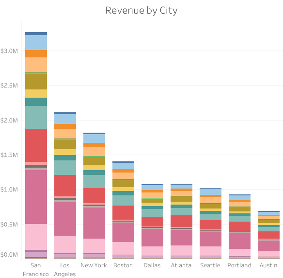
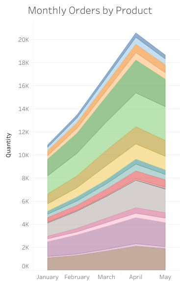
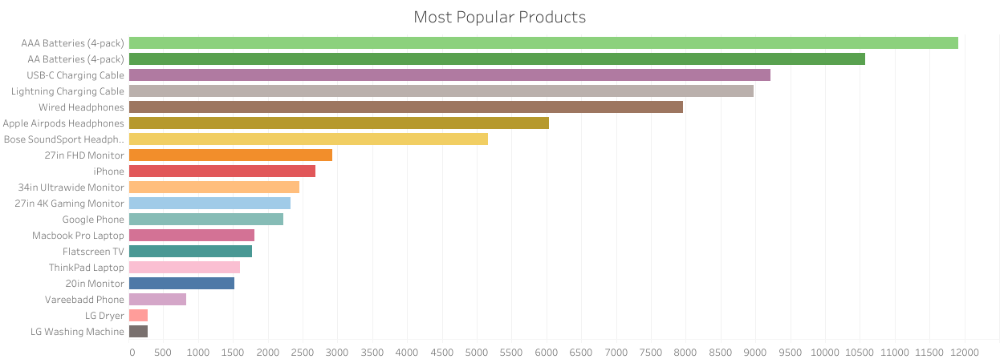

# Ecommerce Analysis

### Project Overview

This project uses a multi-table database to provide an analysis and visualization. The goal is to uncover key insights into order patterns, customer behavior, and product performance.

### Steps Taken

1. **Data Import and Cleaning**: The dataset was imported into SQLite for initial data exploration and cleaning.
2. **Exploratory Data Analysis (EDA)**: Various SQL queries were executed to explore the dataset.
3. **Visualization**: The cleaned data was imported into Tableau for visualization.

### Tools and Technologies

- **SQLite**: Used for data import, cleaning, and executing SQL queries.
- **Tableau**: Employed for creating visualizations and building an interactive dashboard.

### Repository Contents

- **Data**: The raw and cleaned dataset.
- **SQL Scripts**: Scripts used for data cleaning and exploratory analysis.
- **Tableau Workbook**: The workbook containing all visualizations and the dashboard.

### Findings

1. Sales by Location:

- San Francisco had the highest number of orders and revenue.
- Los Angeles was second in terms of orders and revenue.
- New York was third despite its large population.

2. Monthly Sales Trends:

- Sales in January, February, and March were low but showed gradual improvement.
- April peaked in sales.
- May sales were lower than April but higher than March.
  
3. Most Popular Product, but Least Revenue:

- AAA 4-pack batteries and AA 4-pack batteries are by far the most popular products, but they also have the least revenue of any product.

4. Phone Sales:
- Vareebad Phones: Sales are significantly lower compared to iPhones and Google Phones.

### Recommendations
1. Targeted Marketing and Promotions:
- San Francisco, Los Angeles, and New York: Since these cities have the highest orders and revenue, consider focusing marketing efforts and promotions here to further capitalize on the existing customer base.
- New York: Investigate the lower sales compared to its population size. Tailored promotions or local events might boost engagement and sales in this area.

2. Seasonal Sales Strategies:
- January to March: Implement strategies to boost sales during these months, such as seasonal promotions and discounts, to maintain the upward trend after the holiday months.
- April Peak: Analyze the factors contributing to the high sales in April and replicate these strategies for other months.
- Post-April Strategy: Develop a retention and follow-up campaign in May to sustain the momentum gained in April.

3. AAA and AA Batteries Revenue:
- Since these are popular but low in revenue, consider offering larger packages (e.g., 8-pack or 12-pack) to increase the overall revenue per sale.
- Bundle these batteries with complementary products to enhance value.

4. Vareebadd Phone Pricing:
- Consider adjusting pricing strategies to compete better with iPhone and Google Phones.

